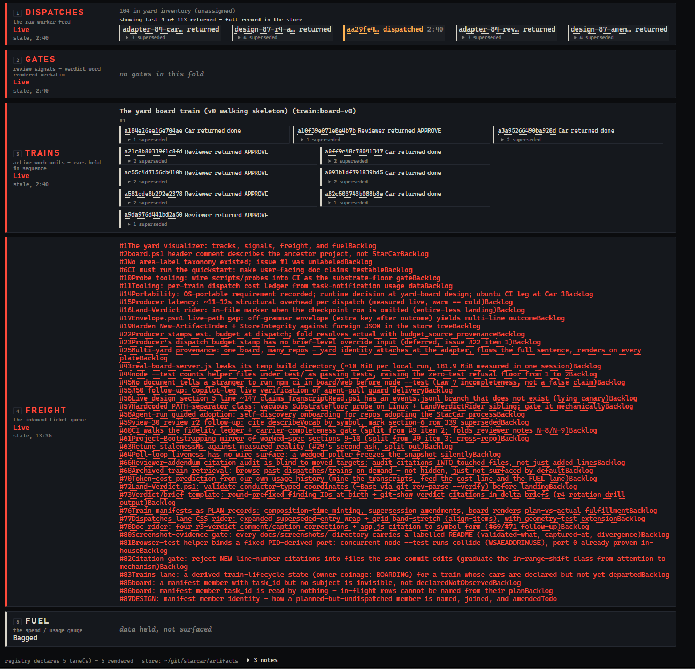

# StarCar

**A visualizer for multi-agent / subagent processing.** Trains, cars, gates, and freight:
watch an agentic development pipeline the way a dispatcher watches a rail yard.

## What it renders

`board/server` (Go) polls this repo's own artifact store (`artifacts/`) once a second and
serves a live view at `board/web/` (vanilla ESM JS, no build step): five lanes, always
rendered, honestly labeled when a lane's data isn't wired up yet.

- **Trains** = manifests: a unit of work run as a sequence of cars, each with its own
  adversarial reviewer.
- **Gates** = review verdicts: design, spec, plan, per-car, whole-branch, CI.
- **Dispatches** = the raw agent-invocation feed underneath trains and gates.
- **Freight** = the ticket queue. `scripts/Sync-Freight.ps1` (#84) is run manually, on
  demand (`docs/setup.md`), reading this repo's own GitHub Project board and writing
  ticket records into the store; the board process itself makes no outbound network
  call, and freight's data is only as fresh as the last person who ran the sync.
- **Fuel** = the usage/cost meter the whole operation is budgeted against. Currently
  **bagged**: cost fields exist on some records but aren't surfaced to this lane yet
  (#11).

The broader vision - pluggable adapters (a git repo, any issue tracker, never hardcoded
to one shop) - is tracked in [#1](https://github.com/polecatspeaks/StarCar/issues/1) and
not yet built: today there are two purpose-built producers (the dispatch-harness scripts
below, and `Sync-Freight.ps1`), not a swappable adapter interface.

Below is the board rendering all five lanes against this repo's real artifact store,
captured 2026-07-27 - not a mockup, not cropped, not chosen for flattery:



That is a **dated observation, not a live-state claim** - full verification and the
defect list are in
[`docs/screenshots/2026-07-27-readme-board/README.md`](docs/screenshots/2026-07-27-readme-board/README.md).
In short: freight's rows have no CSS yet and read as a run-on (#90); freight renders
alarm-red between manual syncs because its staleness threshold is miscalibrated (#63);
the trains lane shows only the original 2026-07-23 walking-skeleton train because nothing
mints a real train manifest yet (#76); the gates lane renders empty despite dozens of real
verdicts in the store, because it only fills from train-manifest membership (#88); one
in-flight row in the dispatches lane renders as a bare runtime hash instead of a human
task-id, because the code that would read a manifest member's `task_id` was never built
(#86); and the trains lane's ten bare hashes beside it are a *different*, honest
rendering - the v0 manifest's own members carry only `subject` and `role`, no `task_id`
at all, so there is nothing to read yet. The board is **local-only and unauthenticated** -
a status board for a repo you already have checked out, not a service to expose on a
network.

## Quickstart

Runs entirely from this checkout, against this repo's own artifact store
(`artifacts/`) - no account, no config file required, and once built, no external
service either.

**Prerequisites** (see [`docs/setup.md`](docs/setup.md) for the full disclosure):
- **Go**, version per [`board/go.mod`](board/go.mod)'s `go` directive (`1.26`). If `go`
  is not on your shell's `PATH`, invoke it by its install path (e.g. on Windows,
  `C:\Program Files\Go\bin\go.exe`) or add that directory to `PATH` for the session.
- **Network access for the first build only.** `board` has one dependency
  (`github.com/santhosh-tekuri/jsonschema/v6`, per `board/go.mod`) and there is no
  `board/vendor/`, so `go run` downloads it from the module proxy the first time; every
  run after that is offline.

```sh
git clone https://github.com/polecatspeaks/StarCar.git
cd StarCar/board
go run ./server
```

Then open <http://127.0.0.1:4600/> in a browser. The server serves:

- `GET /` - the board itself (`board/web/index.html`)
- `GET /api/snapshot` - the current state as JSON
- `GET /api/stream` - the same state as Server-Sent Events, for live updates

Stop it with Ctrl-C. Nothing it does writes to the artifact store, and nothing it serves
leaves your machine.

**Optional: clickable provenance links (issue #28).** Every car/gate/dispatch chip and
every train's declared ticket refs can link out to GitHub - to a subject's record
directory, or to the issue a train's tickets name - if you set two environment
variables before starting the server:

```sh
STARCAR_GITHUB_REPO=your-owner/your-repo STARCAR_GITHUB_REF=dev go run ./server
```

`STARCAR_GITHUB_REPO` is `"owner/repo"`; `STARCAR_GITHUB_REF` defaults to `dev` and
rarely needs setting. **Neither is required** - leave both unset and the board runs
exactly as above, with every subject/ticket rendered as plain text instead of a link
(never a broken one).

**Verified 2026-07-27** from this worktree at base commit `20c3970`, running the exact
command sequence above: `GET /`, `GET /api/snapshot`, and a served JS module
(`GET /js/app.js`) each answered HTTP 200; `GET /api/stream` emitted a real
`event: yard` SSE frame; and the `/api/snapshot` body validated (`valid: true`) against
`schema/yard-snapshot.schema.json` via the same vendored `@cfworker/json-schema`
validator the browser itself uses (`board/web/js/validate.js`). The live snapshot showed
all five registered lanes, freight carrying 41 real tickets, and (with no dispatch
in flight at the moment checked) dispatches/gates/trains all reading `idle` while freight
read `stale` - the freshness-state detail behind the screenshot's caption above.

## Status

This is still v0: one Go process, one static view, no deployment story. Two producers
write into the shared artifact store today. The dispatch-harness scripts:
`scripts/Produce-Artifact.ps1` writes one record per dispatch event, the read-only
`scripts/Detect-Dispatches.ps1` folds the store into dispatch and intent state (`board/server`
runs its own Go port of that same fold, `board/fold`, at poll time, once a second),
`scripts/Artifact.psm1`'s `Test-StarcarArtifact` validates every record, and
`scripts/New-ArtifactIndex.ps1` writes the deterministic `artifacts/index.md` - all
exercised by a Pester suite under CI. And freight's own producer, `scripts/Sync-Freight.ps1`
(#84). Neither is a pluggable adapter in the sense #1 describes; both are hardcoded to this
one shop's own store and GitHub Project.

## Process

This repo demonstrates the same discipline it visualizes: every feature is designed,
adversarially reviewed, test-driven, and gated, with the review verdicts and REJECT
records committed in-repo as they happen. Documentation ranks equal to code here - both
families pass the same gates, and the commit that invalidates a document updates it in
that same commit. When audiences conflict, the stranger deploying this cold wins
(`docs/constitution.md`, Law 7).

Nothing reaches `main` except by pull request - a rule enforced on the remote and
fault-injected to prove it fires, not merely asserted. The record is never curated: the
first thing merged to `main` was the revert of a commit that should not have reached it
([PR #5](https://github.com/polecatspeaks/StarCar/pull/5)), and the failure that let it
through is written up in that PR rather than tidied away.

## Reading order

For the board itself rather than the process that built it:
[`docs/design/2026-07-21-v0-yard-skeleton-design.md`](docs/design/2026-07-21-v0-yard-skeleton-design.md)
(what v0 is and why) and
[`schema/yard-snapshot.schema.json`](schema/yard-snapshot.schema.json) (the wire contract
`board/server` and `board/web` both honor - the actual source of truth for what a lane can
carry).

The list below is the governing-process path, not the only path in. Start at the neutral
front door, [`ONBOARDING.md`](ONBOARDING.md) - it carries the tiered reading path and the
compliance floor for every agent family, then hands off to the ordered list below (#47).

1. [`docs/constitution.md`](docs/constitution.md) - what this project must be (RATIFIED
   2026-07-21, before any code).
2. [`docs/the-healing-loop.md`](docs/the-healing-loop.md) - how the process that builds it
   repairs and hardens itself.
3. [`CLAUDE.md`](CLAUDE.md) - the operating rules, each carrying the scar that earned it.
4. [`docs/templates/design-doc.md`](docs/templates/design-doc.md) - the design workflow: constraints before mechanism, with a worked exemplar built from a real four-round failure.
5. `docs/templates/` - the other working artifacts (car briefs, state ledger, gating matrix).

## License

MIT.
